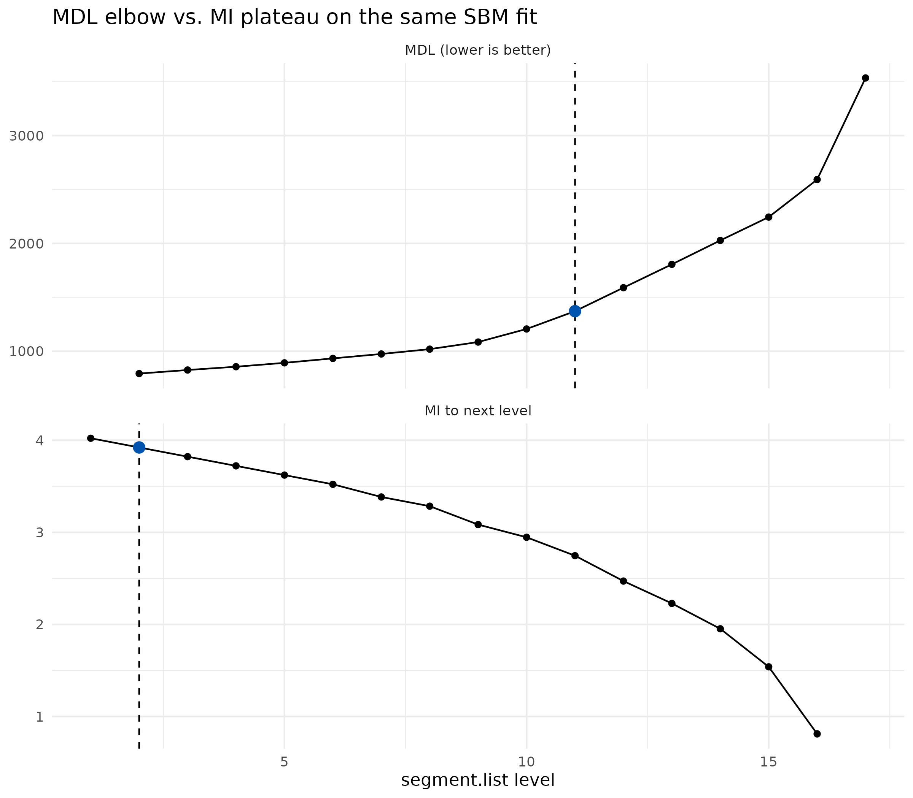

# Auto Level Selection with auto_segment_levels()

## 1. Introduction

[`auto_segment_levels()`](https://gmontaletti.github.io/monecascale/reference/auto_segment_levels.md)
closes a recurring loose end in hierarchical segmentation: the backend
returns a full nested hierarchy, but downstream analysis typically needs
a single level. Picking that level by hand is brittle, does not scale,
and is difficult to justify in a reproducible pipeline.

The function implements two principled, purely post-hoc criteria for
picking a preferred level from a fitted hierarchy. It composes directly
with the two scalable backends in this package:

- [`moneca_sbm()`](https://gmontaletti.github.io/monecascale/reference/moneca_sbm.md)
  (direction D2) - hierarchical DC-SBM on square mobility.
- [`moneca_bipartite()`](https://gmontaletti.github.io/monecascale/reference/moneca_bipartite.md)
  (direction D1) - hierarchical DC-LBM on rectangular mobility, picked
  independently on the row and column sides.

Plain
[`moneca::moneca_fast()`](https://gmontaletti.github.io/MONECA/reference/moneca_fast.html)
output is not yet supported and is rejected with an informative error;
that hook is deferred to monecascale 0.3.1.

Two entry points exist. The function itself takes a fitted object and
returns the pick plus per-level diagnostics. The
`segment.levels = "auto"` argument on
[`moneca_sbm()`](https://gmontaletti.github.io/monecascale/reference/moneca_sbm.md)
and
[`moneca_bipartite()`](https://gmontaletti.github.io/monecascale/reference/moneca_bipartite.md)
is the wrapper sugar: fit the full hierarchy, pick a level, and trim the
returned object to that level in one call.

## 2. Criteria

**MDL elbow.** The criterion walks the per-level Minimum Description
Length (MDL) series (coarse to fine) and picks the point of maximum
perpendicular distance from the chord connecting the two endpoints. This
is the Kneedle heuristic (Satopaa et al. 2011) and is the default. An
alternative `mdl_elbow = "max_second_diff"` selects the discrete
second-difference peak, which is more sensitive on short hierarchies but
noisier on long ones. On
[`moneca_sbm()`](https://gmontaletti.github.io/monecascale/reference/moneca_sbm.md)
the MDL series is `-ICL` from
[`greed::DcSbm`](https://comeetie.github.io/greed/reference/DcSbm.html);
on
[`moneca_bipartite()`](https://gmontaletti.github.io/monecascale/reference/moneca_bipartite.md)
the per-side series is `-joint_icl` from
[`greed::DcLbm`](https://comeetie.github.io/greed/reference/DcLbm.html),
sliced to the side at hand. In both cases lower is better, so Kneedle
detects the knee of a decreasing curve.

**MI plateau.** The criterion computes level-to-level mutual information
`I(m_l, m_{l+1})` between adjacent hierarchy levels directly from
`segment.list`, independently of backend diagnostics. `I(m_l, m_{l+1})`
measures how much structure level `l+1` shares with the coarser level
`l`: it is high when refinement is consistent with what was there at the
coarser level and drops where refinement begins to reshuffle
memberships. The plateau is the first level whose gain `I_l - I_{l-1}`
falls below `plateau_tol * max(I)` - the resolution at which further
refinement adds little and is therefore heuristically redundant. If no
plateau is detected the finest level is returned.

The two criteria use different inputs (MDL series vs. membership
vectors), so they can and often do disagree. That disagreement is itself
diagnostic, as illustrated in section 6.

## 3. Quick start on SBM

The quickest way to see the function at work is on a synthetic mobility
fixture small enough to build in a vignette. We keep the fixture inline
rather than sourcing the test helpers.

``` r
library(monecascale)

# 1. synthetic fixture -----
mob <- moneca::generate_mobility_data(
  n_classes = 20,
  n_total = 5000,
  immobility_strength = 0.5,
  class_clustering = 0.75,
  noise_level = 0.05,
  seed = 2026
)

# 2. full hierarchy fit -----
fit <- monecascale::moneca_sbm(mob, backend = "greed", seed = 2026)

# 3. pick a level post-hoc -----
res <- monecascale::auto_segment_levels(fit, method = "mdl")
res
#> <auto_segment_levels> method=mdl backend=sbm picked level=11 of 16
#>  level n_blocks       mdl mi_to_next     score
#>      2       17  793.0154         NA  793.0154
#>      3       16  826.1811         NA  826.1811
#>      4       15  856.5932         NA  856.5932
#>      5       14  892.5546         NA  892.5546
#>      6       13  933.7947         NA  933.7947
#>      7       12  974.8118         NA  974.8118
#>      8       11 1019.7153         NA 1019.7153
#>      9       10 1085.4879         NA 1085.4879
#>     10        9 1206.5826         NA 1206.5826
#>     11        8 1371.6359         NA 1371.6359
#>     12        7 1589.5938         NA 1589.5938
#>     13        6 1806.0638         NA 1806.0638
#>     14        5 2027.6486         NA 2027.6486
#>     15        4 2244.2453         NA 2244.2453
#>     16        3 2592.2005         NA 2592.2005
#>     17        2 3534.6014         NA 3534.6014
```

The printed header exposes method, backend, picked level, and the total
number of levels available. The diagnostics table holds the full
per-level trace used to make the pick, which is useful both as an audit
record and for plotting the criterion curve.

``` r
res$diagnostics
#>    level n_blocks       mdl mi_to_next     score
#> 1      2       17  793.0154         NA  793.0154
#> 2      3       16  826.1811         NA  826.1811
#> 3      4       15  856.5932         NA  856.5932
#> 4      5       14  892.5546         NA  892.5546
#> 5      6       13  933.7947         NA  933.7947
#> 6      7       12  974.8118         NA  974.8118
#> 7      8       11 1019.7153         NA 1019.7153
#> 8      9       10 1085.4879         NA 1085.4879
#> 9     10        9 1206.5826         NA 1206.5826
#> 10    11        8 1371.6359         NA 1371.6359
#> 11    12        7 1589.5938         NA 1589.5938
#> 12    13        6 1806.0638         NA 1806.0638
#> 13    14        5 2027.6486         NA 2027.6486
#> 14    15        4 2244.2453         NA 2244.2453
#> 15    16        3 2592.2005         NA 2592.2005
#> 16    17        2 3534.6014         NA 3534.6014
```

Switching criterion is a one-argument change:

``` r
res_mi <- monecascale::auto_segment_levels(fit, method = "mi_plateau")
res_mi
#> <auto_segment_levels> method=mi_plateau backend=sbm picked level=2 of 17
#>  level n_blocks mdl mi_to_next     score
#>      1       20  NA  4.0219281 4.0219281
#>      2       17  NA  3.9219281 3.9219281
#>      3       16  NA  3.8219281 3.8219281
#>      4       15  NA  3.7219281 3.7219281
#>      5       14  NA  3.6219281 3.6219281
#>      6       13  NA  3.5219281 3.5219281
#>      7       12  NA  3.3841837 3.3841837
#>      8       11  NA  3.2841837 3.2841837
#>      9       10  NA  3.0841837 3.0841837
#>     10        9  NA  2.9464393 2.9464393
#>     11        8  NA  2.7464393 2.7464393
#>     12        7  NA  2.4709506 2.4709506
#>     13        6  NA  2.2282129 2.2282129
#>     14        5  NA  1.9527242 1.9527242
#>     15        4  NA  1.5394911 1.5394911
#>     16        3  NA  0.8112781 0.8112781
#>     17        2  NA         NA        NA
```

`method = "mi_plateau"` ignores `mdl_per_level` and operates directly on
the cliques stored in `segment.list`, so it works unchanged on any
hierarchy produced by this package.

## 4. Wrapper sugar: segment.levels = “auto”

[`moneca_sbm()`](https://gmontaletti.github.io/monecascale/reference/moneca_sbm.md)
and
[`moneca_bipartite()`](https://gmontaletti.github.io/monecascale/reference/moneca_bipartite.md)
accept `segment.levels = "auto"`. The wrapper fits the full hierarchy,
delegates to
[`auto_segment_levels()`](https://gmontaletti.github.io/monecascale/reference/auto_segment_levels.md),
and trims the returned object down to the picked level. The picker
result is attached so callers can still inspect what happened.

``` r
fit_auto <- monecascale::moneca_sbm(
  mob,
  backend = "greed",
  seed = 2026,
  segment.levels = "auto",
  auto_method = "mdl"
)

# The full-hierarchy fit would have returned length(segment.list) levels;
# after trimming we see only those up to the pick.
length(fit_auto$segment.list)
#> [1] 11

# The picker result is retained for auditability.
fit_auto$auto_level
#> <auto_segment_levels> method=mdl backend=sbm picked level=11 of 16
#>  level n_blocks       mdl mi_to_next     score
#>      2       17  793.0154         NA  793.0154
#>      3       16  826.1811         NA  826.1811
#>      4       15  856.5932         NA  856.5932
#>      5       14  892.5546         NA  892.5546
#>      6       13  933.7947         NA  933.7947
#>      7       12  974.8118         NA  974.8118
#>      8       11 1019.7153         NA 1019.7153
#>      9       10 1085.4879         NA 1085.4879
#>     10        9 1206.5826         NA 1206.5826
#>     11        8 1371.6359         NA 1371.6359
#>     12        7 1589.5938         NA 1589.5938
#>     13        6 1806.0638         NA 1806.0638
#>     14        5 2027.6486         NA 2027.6486
#>     15        4 2244.2453         NA 2244.2453
#>     16        3 2592.2005         NA 2592.2005
#>     17        2 3534.6014         NA 3534.6014

# The object is otherwise a plain moneca-class object.
class(fit_auto)
#> [1] "moneca"
```

The trimmed object is a regular moneca-class object: the
`moneca::segment.*()` and `moneca::plot_moneca_*()` APIs run on it
unchanged. `auto_method = "mi_plateau"` is accepted symmetrically and
dispatches to the MI criterion inside the wrapper.

## 5. Bipartite

On a bipartite fit the two sides are clustered jointly but exposed
through two one-mode projections.
[`auto_segment_levels()`](https://gmontaletti.github.io/monecascale/reference/auto_segment_levels.md)
recurses into `$rows` and `$cols`, runs the criterion independently on
each side, and returns a named list. The two sides may land on different
levels.

``` r
# 1. rectangular fixture with planted row / column blocks -----
set.seed(2026)
n_row <- 60
n_col <- 40
row_block <- rep(seq_len(4), length.out = n_row)
col_block <- rep(seq_len(3), length.out = n_col)
lambda <- outer(row_block, col_block, function(g, h) {
  ifelse((g - 1) %% 3 + 1 == h, 6, 1)
})
mx <- matrix(stats::rpois(n_row * n_col, lambda = lambda), n_row, n_col)
rownames(mx) <- paste0("R", seq_len(n_row))
colnames(mx) <- paste0("C", seq_len(n_col))

# 2. full bipartite fit -----
bip_fit <- monecascale::moneca_bipartite(mx, seed = 2026, verbose = FALSE)
```

``` r
bip_res <- monecascale::auto_segment_levels(bip_fit, method = "mdl")

# Two independent picks, one per side.
names(bip_res)
#> [1] "rows" "cols"
bip_res$rows
#> <auto_segment_levels> method=mdl backend=bipartite_rows picked level=3 of 4
#>  level n_blocks      mdl mi_to_next    score
#>      2        3 62529.90         NA 62529.90
#>      3        2 63607.83         NA 63607.83
#>      4        2 63588.51         NA 63588.51
#>      5        1 64976.75         NA 64976.75
bip_res$cols
#> <auto_segment_levels> method=mdl backend=bipartite_cols picked level=5 of 4
#>  level n_blocks      mdl mi_to_next    score
#>      2        3 62529.90         NA 62529.90
#>      3        3 63607.83         NA 63607.83
#>      4        2 63588.51         NA 63588.51
#>      5        2 64976.75         NA 64976.75
```

The wrapper form behaves the same way as on SBM, except that the
trimming is applied per side:

``` r
bip_auto <- monecascale::moneca_bipartite(
  mx,
  seed = 2026,
  verbose = FALSE,
  segment.levels = "auto",
  auto_method = "mdl"
)

# Per-side picks; the two sides may disagree.
bip_auto$rows$auto_level$level
#> [1] 3
bip_auto$cols$auto_level$level
#> [1] 5
length(bip_auto$rows$segment.list)
#> [1] 3
length(bip_auto$cols$segment.list)
#> [1] 5
```

## 6. Criterion comparison

MDL elbow and MI plateau see different signals: the first operates on a
backend goodness-of-fit trace, the second on the memberships the
hierarchy actually delivered. On the same fit we can run both and
inspect the two curves side by side.

``` r
res_mdl <- monecascale::auto_segment_levels(fit, method = "mdl")
res_mi  <- monecascale::auto_segment_levels(fit, method = "mi_plateau")

# Picks
c(mdl = res_mdl$level, mi_plateau = res_mi$level)
#>        mdl mi_plateau 
#>         11          2
```

The diagnostics tables carry the series each criterion used.

``` r
res_mdl$diagnostics[, c("level", "n_blocks", "mdl")]
#>    level n_blocks       mdl
#> 1      2       17  793.0154
#> 2      3       16  826.1811
#> 3      4       15  856.5932
#> 4      5       14  892.5546
#> 5      6       13  933.7947
#> 6      7       12  974.8118
#> 7      8       11 1019.7153
#> 8      9       10 1085.4879
#> 9     10        9 1206.5826
#> 10    11        8 1371.6359
#> 11    12        7 1589.5938
#> 12    13        6 1806.0638
#> 13    14        5 2027.6486
#> 14    15        4 2244.2453
#> 15    16        3 2592.2005
#> 16    17        2 3534.6014
res_mi$diagnostics[, c("level", "n_blocks", "mi_to_next")]
#>    level n_blocks mi_to_next
#> 1      1       20  4.0219281
#> 2      2       17  3.9219281
#> 3      3       16  3.8219281
#> 4      4       15  3.7219281
#> 5      5       14  3.6219281
#> 6      6       13  3.5219281
#> 7      7       12  3.3841837
#> 8      8       11  3.2841837
#> 9      9       10  3.0841837
#> 10    10        9  2.9464393
#> 11    11        8  2.7464393
#> 12    12        7  2.4709506
#> 13    13        6  2.2282129
#> 14    14        5  1.9527242
#> 15    15        4  1.5394911
#> 16    16        3  0.8112781
#> 17    17        2         NA
```

If `ggplot2` is available we can plot the two curves with the picks
annotated. Otherwise the tables above are the portable summary.

``` r
# 1. prepare panels -----
mdl_df <- res_mdl$diagnostics
mdl_df$criterion <- "MDL (lower is better)"
mdl_df$value <- mdl_df$mdl

mi_df <- res_mi$diagnostics
mi_df$criterion <- "MI to next level"
mi_df$value <- mi_df$mi_to_next

plot_df <- rbind(
  mdl_df[, c("level", "n_blocks", "value", "criterion")],
  mi_df[, c("level", "n_blocks", "value", "criterion")]
)
plot_df <- plot_df[is.finite(plot_df$value), ]

# 2. pick annotations -----
picks <- data.frame(
  criterion = c("MDL (lower is better)", "MI to next level"),
  level = c(res_mdl$level, res_mi$level)
)
picks$value <- mapply(
  function(cr, lvl) {
    sub <- plot_df[plot_df$criterion == cr & plot_df$level == lvl, "value"]
    if (length(sub) == 0) NA_real_ else sub[1]
  },
  picks$criterion,
  picks$level
)

# 3. stacked panel -----
ggplot2::ggplot(
  plot_df,
  ggplot2::aes(x = level, y = value)
) +
  ggplot2::geom_line() +
  ggplot2::geom_point() +
  ggplot2::geom_vline(
    data = picks,
    mapping = ggplot2::aes(xintercept = level),
    linetype = 2
  ) +
  ggplot2::geom_point(
    data = picks[is.finite(picks$value), ],
    mapping = ggplot2::aes(x = level, y = value),
    colour = "#0054AD",
    size = 3
  ) +
  ggplot2::facet_wrap(~ criterion, ncol = 1, scales = "free_y") +
  ggplot2::labs(
    x = "segment.list level",
    y = NULL,
    title = "MDL elbow vs. MI plateau on the same SBM fit"
  ) +
  ggplot2::theme_minimal(base_size = 11)
```



The two criteria frequently agree on well-structured data; when they
disagree, MDL tends to pick a coarser level than MI plateau on
hierarchies where refinement keeps consistent sub-blocks but the MDL
curve is still trending down.

## 7. Limitations

- **[`moneca::moneca_fast()`](https://gmontaletti.github.io/MONECA/reference/moneca_fast.html)
  output is not supported.** The function errors out on fast-backend
  objects. Deferred to 0.3.1.
- **Single-criterion set.** Only MDL elbow and MI plateau are shipped in
  0.3.0. Modularity-based picks and bootstrap stability criteria are on
  the roadmap but not in scope for this release.
- **`plateau_tol` is a heuristic.** The default 0.05 works well on
  moderate hierarchies but may need tightening on tight elbows or
  loosening on noisy MI curves. The argument is surfaced on
  [`auto_segment_levels()`](https://gmontaletti.github.io/monecascale/reference/auto_segment_levels.md)
  for that reason.
- **Short hierarchies degrade gracefully.** On fits with at most two
  levels in `segment.list`, both criteria fall back to the finest level.
  The diagnostics table still reports per-level values where they can be
  computed.

## 8. References

- Satopaa, V., Albrecht, J., Irwin, D., & Raghavan, B. (2011). Finding a
  “Kneedle” in a Haystack: Detecting Knee Points in System Behavior.
  *31st International Conference on Distributed Computing Systems
  Workshops*, 166-171.
- Cover, T. M., & Thomas, J. A. (2006). *Elements of Information Theory*
  (2nd ed.). Wiley.
- Come, E., Jouvin, N., Latouche, P., Bouveyron, C., Bataillon, E., &
  Chen, A. (2021). Hierarchical clustering with discrete latent variable
  models and the integrated classification likelihood. *Advances in Data
  Analysis and Classification*, 15, 957-986.
- Karrer, B., & Newman, M. E. J. (2011). Stochastic blockmodels and
  community structure in networks. *Physical Review E*, 83, 016107.
