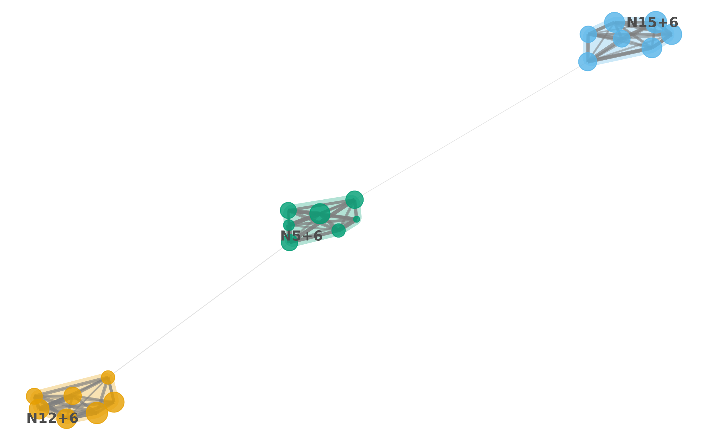

# Flow Clustering with moneca_flow()

## 1. Introduction

[`moneca_flow()`](https://gmontaletti.github.io/monecascale/reference/moneca_flow.md)
is the flow-based clustering backend for MONECA. It clusters the
mobility graph under the Map Equation (Rosvall & Bergstrom, 2008): a
random walker traverses the directed mobility network and modules are
extracted as regions where the walker tends to stay for many steps
before transitioning away. This reading aligns directly with the
substantive semantics of the data — workers flow through jobs, and
modules trap flow.

Three backends cover complementary views of the same mobility matrix:

- [`moneca::moneca_fast()`](https://gmontaletti.github.io/MONECA/reference/moneca_fast.html)
  — clique enumeration on the thresholded relative-risk (RR) matrix.
- [`moneca_sbm()`](https://gmontaletti.github.io/monecascale/reference/moneca_sbm.md)
  (direction D2) — hierarchical DC-SBM on the RR residual. See
  [`vignette("monecascale-sbm")`](https://gmontaletti.github.io/monecascale/articles/monecascale-sbm.md)
  for the theoretical bridge and an empirical parity experiment.
- [`moneca_bipartite()`](https://gmontaletti.github.io/monecascale/reference/moneca_bipartite.md)
  (direction D1) — hierarchical DC-LBM on rectangular mobility, joint on
  both sides.
- [`moneca_flow()`](https://gmontaletti.github.io/monecascale/reference/moneca_flow.md)
  (direction D3, this vignette) — Infomap on raw mobility flow, with a
  recursive wrapper that synthesises an approximate hierarchy.

The SBM view clusters nodes that are stochastically equivalent under the
independence null; the flow view clusters nodes that the walker visits
together. The two views frequently agree in the high-signal regime and
may diverge where directional asymmetry matters. Section 7 shows a
side-by-side comparison on a single fixture.

## 2. The Map Equation

The Map Equation frames community detection as a lossless coding
problem. Given a partition `M` of the graph into modules, the walker’s
trajectory is encoded with a two-level codebook: an index-level codebook
for module-to-module transitions, and one per-module codebook for
within-module node visits plus a module exit symbol. The average number
of bits per step under this encoding is the codelength

$$L(M) = q_{\curvearrowleft}\, H(\mathcal{Q}) + \sum\limits_{k = 1}^{K}p_{k}^{\circlearrowright}\, H\left( \mathcal{P}_{k} \right),$$

where `q_↶` is the total module-switching rate, `H(Q)` is the entropy of
the index codebook, `p_k^↻` is the within-module use rate of module `k`,
and `H(P_k)` is the entropy of its within-module codebook. Minimising
`L(M)` is equivalent to maximising the compression of the walker’s
trajectory: modules that trap flow for many steps shorten the
description, modules that shuffle flow around lengthen it.

In MONECA the edges are directed mobility counts, so the stationary
distribution used to weight the entropies is computed from PageRank on
the directed graph.
[`moneca_flow()`](https://gmontaletti.github.io/monecascale/reference/moneca_flow.md)
computes `L(M)` directly on the full graph for every level of the
hierarchy, so codelength values are comparable across levels rather than
inferred from sub-module fits.

## 3. Flat vs recursive hierarchy

[`igraph::cluster_infomap()`](https://r.igraph.org/reference/cluster_infomap.html),
the engine behind the `"igraph"` backend, returns a flat partition. To
expose a hierarchy compatible with moneca’s multi-level contract,
[`moneca_flow()`](https://gmontaletti.github.io/monecascale/reference/moneca_flow.md)
applies a recursive wrapper: for level 2 it re-runs flat Infomap on each
level-1 module’s induced subgraph; for level 3 it recurses once more on
each level-2 sub-module. Parent modules smaller than two nodes become
singleton children.

This is an **approximation** to true hierarchical Infomap. The orthodox
hierarchical Map Equation (Rosvall et al., 2009) jointly optimises the
codelength of the full hierarchy, trading off top-level compression
against sub-module compression in a single criterion. Recursive flat
fits instead optimise each level independently and then stack the
results. On well-separated block structures the two agree closely; on
ambiguous or deeply nested hierarchies the recursive approximation can
under- or over-fit specific levels.

Users who need joint-MDL hierarchical Infomap should watch for a
`bioregion`-backed or `"infomap_cpp"` backend planned for a future
release. The recursive flat approach is shipped now because it keeps the
dependency surface to `igraph` alone.

## 4. Quick start

A minimal end-to-end run on a synthetic block-Poisson fixture:

``` r
library(monecascale)

# 1. inline block-Poisson fixture -----
set.seed(2026)
n <- 21
block <- rep(1:3, each = 7)
lambda <- outer(block, block, function(g, h) ifelse(g == h, 6, 0.2))
M <- matrix(stats::rpois(n * n, lambda = lambda), n, n)
diag(M) <- 0
rownames(M) <- colnames(M) <- paste0("N", seq_len(n))

# 2. flow fit -----
out <- monecascale::moneca_flow(M, depth = 2L, seed = 2026)
out
#> 
#> ================================================================================
#>                         moneca MOBILITY ANALYSIS RESULTS                        
#> ================================================================================
#> 
#> OVERALL MOBILITY PATTERNS
#> -------------------------------------------------------------------------------
#> Overall Population Mobility Rate:                   100.0%
#> Average Mobility Concentration (all levels):         94.0%
#> 
#> HIERARCHICAL SEGMENTATION ANALYSIS
#> -------------------------------------------------------------------------------
#> 
#> Internal Mobility Within Segments (%):
#> Level 1 Level 2 Level 3 
#>     0.0    93.8    93.8 
#> 
#> Mobility Concentration in Significant Pathways by Level (%):
#> Level 1 Level 2 Level 3 
#>    94.3    93.8    93.8 
#> 
#> Network Structure by Level:
#>                                    Level 1      Level 2      Level 3 
#> -------------------------------------------------------------------------------
#> Active Segments/Classes:                21            3            3 
#> Significant Edges:                     128            0            0 
#> Network Density:                     0.305        0.000        0.000 
#> Isolated Segments:                       0            3            3 
#> 
#> DETAILED WEIGHTED DEGREE DISTRIBUTIONS (STRENGTH)
#> -------------------------------------------------------------------------------
#> 
#> Total Weighted Connections (Strength In + Out):
#>           Min    Q1 Median  Mean    Q3   Max
#> Level 1 35.96 37.43  38.78 39.83 41.19 45.59
#> Level 2  0.00  0.00   0.00  0.00  0.00  0.00
#> Level 3  0.00  0.00   0.00  0.00  0.00  0.00
#> 
#> Outward Mobility Strength (Weighted Out-Degree):
#>           Min    Q1 Median  Mean    Q3   Max
#> Level 1 16.88 18.69   19.4 19.91 21.26 22.68
#> Level 2  0.00  0.00    0.0  0.00  0.00  0.00
#> Level 3  0.00  0.00    0.0  0.00  0.00  0.00
#> 
#> Inward Mobility Strength (Weighted In-Degree):
#>           Min    Q1 Median  Mean    Q3   Max
#> Level 1 17.16 18.83  19.49 19.91 20.71 23.63
#> Level 2  0.00  0.00   0.00  0.00  0.00  0.00
#> Level 3  0.00  0.00   0.00  0.00  0.00  0.00
#> 
#> Edge Weight Distribution (Relative Risk Values):
#>         Min   Q1 Median Mean   Q3  Max
#> Level 1   1 2.49   3.35 3.27 4.16 6.38
#> Level 2  NA   NA     NA  NaN   NA   NA
#> Level 3  NA   NA     NA  NaN   NA   NA
#> 
#> ================================================================================

# 3. codelength trace and per-level block counts -----
out$flow_diagnostics$codelength_per_level
#> [1] 3.685405 3.235813
out$flow_diagnostics$n_blocks_per_level
#> [1] 3 3
```

`out` is a regular moneca-class object: `segment.list`, `mat.list`, and
`segment_metadata` follow the same contract as
[`moneca::moneca_fast()`](https://gmontaletti.github.io/MONECA/reference/moneca_fast.html).
The `$flow_diagnostics` slot adds the flow- specific trace (codelength
per level, block counts, backend, depth).
`$flow_diagnostics$mdl_per_level` is an alias of `$codelength_per_level`
so tooling keyed on `$mdl_per_level` consumes flow output unchanged.

## 5. Auto-level selection

The auto-level machinery
([`auto_segment_levels()`](https://gmontaletti.github.io/monecascale/reference/auto_segment_levels.md),
direction D6) composes with flow fits without modification. The MDL
criterion reads the codelength trace under the hood; diagnostics are
exposed in a `codelength` column rather than `mdl` to match the flow
semantics.

``` r
# 1. post-hoc pick from a full-hierarchy fit -----
pick <- monecascale::auto_segment_levels(out, method = "mdl")
pick
#> <auto_segment_levels> method=mdl backend=flow picked level=3 of 2
#>  level n_blocks codelength mi_to_next    score
#>      2        3   3.685405         NA 3.685405
#>      3        3   3.235813         NA 3.235813
pick$diagnostics
#>   level n_blocks codelength mi_to_next    score
#> 1     2        3   3.685405         NA 3.685405
#> 2     3        3   3.235813         NA 3.235813
```

The wrapper form trims the fit to the picked level in one call:

``` r
out_auto <- monecascale::moneca_flow(
  M,
  depth = 2L,
  seed = 2026,
  segment.levels = "auto",
  auto_method = "mdl"
)

# Number of levels retained after trimming, plus the picker record
length(out_auto$segment.list)
#> [1] 3
out_auto$auto_level$level
#> [1] 3
```

`method = "mi_plateau"` works identically on flow fits: it reads
memberships from `segment.list` and never touches the backend trace, so
it is backend-agnostic.

## 6. Downstream compatibility

Flow fits reuse moneca’s entire analysis and plotting stack. Membership
extraction and segment quality diagnostics run unchanged:

``` r
# 1. level-2 memberships as a vector -----
mem_l2 <- moneca::segment.membership(out, level = 2)
head(mem_l2)
#>   name membership
#> 1   N1        2.1
#> 2   N2        2.1
#> 3   N3        2.1
#> 4   N4        2.1
#> 5   N5        2.1
#> 6   N6        2.1
```

``` r
# 2. moneca's segment-quality summary on the flow fit -----
moneca::segment.quality(out)
#>     Membership 1: Segment 1: within.mobility 1: share.of.mobility 1: Density
#> N16        3.3         16                  0                0.056        NaN
#> N17        3.3         17                  0                0.053        NaN
#> N15        3.3         15                  0                0.052        NaN
#> N21        3.3         21                  0                0.052        NaN
#> N19        3.3         19                  0                0.048        NaN
#> N18        3.3         18                  0                0.046        NaN
#> N20        3.3         20                  0                0.045        NaN
#> N12        3.2         12                  0                0.056        NaN
#> N9         3.2          9                  0                0.053        NaN
#> N11        3.2         11                  0                0.052        NaN
#> N10        3.2         10                  0                0.051        NaN
#> N14        3.2         14                  0                0.047        NaN
#> N13        3.2         13                  0                0.044        NaN
#> N8         3.2          8                  0                0.041        NaN
#> N5         3.1          5                  0                0.053        NaN
#> N7         3.1          7                  0                0.047        NaN
#> N6         3.1          6                  0                0.045        NaN
#> N4         3.1          4                  0                0.044        NaN
#> N2         3.1          2                  0                0.041        NaN
#> N3         3.1          3                  0                0.038        NaN
#> N1         3.1          1                  0                0.036        NaN
#>     1: Nodes 1: Max.path 1: share.of.total 2: Segment 2: within.mobility
#> N16        1           0             0.056          3              0.946
#> N17        1           0             0.053          3              0.946
#> N15        1           0             0.052          3              0.946
#> N21        1           0             0.052          3              0.946
#> N19        1           0             0.048          3              0.946
#> N18        1           0             0.046          3              0.946
#> N20        1           0             0.045          3              0.946
#> N12        1           0             0.056          2              0.935
#> N9         1           0             0.053          2              0.935
#> N11        1           0             0.052          2              0.935
#> N10        1           0             0.051          2              0.935
#> N14        1           0             0.047          2              0.935
#> N13        1           0             0.044          2              0.935
#> N8         1           0             0.041          2              0.935
#> N5         1           0             0.053          1              0.933
#> N7         1           0             0.047          1              0.933
#> N6         1           0             0.045          1              0.933
#> N4         1           0             0.044          1              0.933
#> N2         1           0             0.041          1              0.933
#> N3         1           0             0.038          1              0.933
#> N1         1           0             0.036          1              0.933
#>     2: share.of.mobility 2: Density 2: Nodes 2: Max.path 2: share.of.total
#> N16                0.352  0.7142857        7           2             0.352
#> N17                0.352  0.7142857        7           2             0.352
#> N15                0.352  0.7142857        7           2             0.352
#> N21                0.352  0.7142857        7           2             0.352
#> N19                0.352  0.7142857        7           2             0.352
#> N18                0.352  0.7142857        7           2             0.352
#> N20                0.352  0.7142857        7           2             0.352
#> N12                0.344  0.7142857        7           2             0.344
#> N9                 0.344  0.7142857        7           2             0.344
#> N11                0.344  0.7142857        7           2             0.344
#> N10                0.344  0.7142857        7           2             0.344
#> N14                0.344  0.7142857        7           2             0.344
#> N13                0.344  0.7142857        7           2             0.344
#> N8                 0.344  0.7142857        7           2             0.344
#> N5                 0.305  0.7142857        7           2             0.305
#> N7                 0.305  0.7142857        7           2             0.305
#> N6                 0.305  0.7142857        7           2             0.305
#> N4                 0.305  0.7142857        7           2             0.305
#> N2                 0.305  0.7142857        7           2             0.305
#> N3                 0.305  0.7142857        7           2             0.305
#> N1                 0.305  0.7142857        7           2             0.305
#>     3: Segment 3: within.mobility 3: share.of.mobility 3: Density 3: Nodes
#> N16          3              0.946                0.352  0.7142857        7
#> N17          3              0.946                0.352  0.7142857        7
#> N15          3              0.946                0.352  0.7142857        7
#> N21          3              0.946                0.352  0.7142857        7
#> N19          3              0.946                0.352  0.7142857        7
#> N18          3              0.946                0.352  0.7142857        7
#> N20          3              0.946                0.352  0.7142857        7
#> N12          2              0.935                0.344  0.7142857        7
#> N9           2              0.935                0.344  0.7142857        7
#> N11          2              0.935                0.344  0.7142857        7
#> N10          2              0.935                0.344  0.7142857        7
#> N14          2              0.935                0.344  0.7142857        7
#> N13          2              0.935                0.344  0.7142857        7
#> N8           2              0.935                0.344  0.7142857        7
#> N5           1              0.933                0.305  0.7142857        7
#> N7           1              0.933                0.305  0.7142857        7
#> N6           1              0.933                0.305  0.7142857        7
#> N4           1              0.933                0.305  0.7142857        7
#> N2           1              0.933                0.305  0.7142857        7
#> N3           1              0.933                0.305  0.7142857        7
#> N1           1              0.933                0.305  0.7142857        7
#>     3: Max.path 3: share.of.total
#> N16           2             0.352
#> N17           2             0.352
#> N15           2             0.352
#> N21           2             0.352
#> N19           2             0.352
#> N18           2             0.352
#> N20           2             0.352
#> N12           2             0.344
#> N9            2             0.344
#> N11           2             0.344
#> N10           2             0.344
#> N14           2             0.344
#> N13           2             0.344
#> N8            2             0.344
#> N5            2             0.305
#> N7            2             0.305
#> N6            2             0.305
#> N4            2             0.305
#> N2            2             0.305
#> N3            2             0.305
#> N1            2             0.305
```

ggraph-based plotting is gated on the optional `ggraph` dependency:

``` r
moneca::plot_moneca_ggraph(out, level = 2)
```



## 7. SBM vs Flow on the same fixture

The SBM and flow views answer different structural questions on the same
data. Running both on a single fixture makes the comparison concrete. We
reuse the fixture from section 4 and fit both backends with two
recursion / hierarchy levels.

``` r
# 1. flow fit -----
fit_flow <- monecascale::moneca_flow(M, depth = 2L, seed = 2026)

# 2. SBM fit (greed backend) -----
fit_sbm <- monecascale::moneca_sbm(
  M,
  backend = "greed",
  seed = 2026
)

# 3. level-2 memberships from each (as vectors) -----
mem_flow <- moneca::segment.membership(fit_flow, level = 2)[[1]]
mem_sbm  <- moneca::segment.membership(fit_sbm,  level = 2)[[1]]

length(unique(mem_flow))
#> [1] 21
length(unique(mem_sbm))
#> [1] 21
```

If `mclust` is available we can quantify agreement with the adjusted
Rand index and normalised mutual information.

``` r
ari <- mclust::adjustedRandIndex(mem_flow, mem_sbm)
nmi <- {
  # 1. plug-in NMI from a contingency table -----
  tab <- table(mem_flow, mem_sbm)
  p   <- tab / sum(tab)
  pr  <- rowSums(p)
  pc  <- colSums(p)
  H   <- function(x) {
    x <- x[x > 0]
    -sum(x * log(x))
  }
  mi <- sum(p[p > 0] * log(p[p > 0] / outer(pr, pc)[p > 0]))
  mi / sqrt(H(pr) * H(pc))
}
c(ARI = ari, NMI = nmi)
#> ARI NMI 
#> NaN   1
```

On block-Poisson fixtures with clean planted structure the two backends
converge: flow and SBM recover the same partition because both the
stationary flow and the stochastic-equivalence signal point at the same
blocks. They diverge when directional asymmetry carries real structure —
for instance, when a transient module feeds flow into an absorbing one:
flow tends to merge them into a single trap, SBM keeps them distinct
because their in/out degree profiles differ. Running both and inspecting
disagreement is a practical diagnostic.

## 8. Limitations

- **Recursive flat approximates joint-MDL hierarchical Infomap.** The
  shipped wrapper optimises each level independently. For strict
  hierarchical codelength minimisation use the standalone Infomap C++
  binary; a `bioregion`-backed backend is planned for v0.5.0.
- **No overlapping communities.** The underlying Map Equation supports
  overlapping modules via the two-level memory-based variant, but
  [`moneca_flow()`](https://gmontaletti.github.io/monecascale/reference/moneca_flow.md)
  produces hard partitions only. The moneca contract assumes hard
  membership vectors.
- **Raw mobility counts only.**
  [`moneca_flow()`](https://gmontaletti.github.io/monecascale/reference/moneca_flow.md)
  does not apply the RR transformation. Users who want RR-weighted flow
  clustering should preprocess the matrix themselves, or reach for
  [`moneca_sbm()`](https://gmontaletti.github.io/monecascale/reference/moneca_sbm.md)
  which consumes RR natively via the DC-SBM bridge.
- **Single backend in 0.4.0.** Only the `igraph` backend is shipped. The
  `"infomap_cpp"` keyword is reserved but not wired up.
- **Depth capped at 3.** The recursive wrapper supports `depth` in
  `1:3`. Deeper hierarchies rarely add signal and are better served by
  auto-level selection on a full SBM hierarchy.

## 9. References

- Rosvall, M., & Bergstrom, C. T. (2008). Maps of random walks on
  complex networks reveal community structure. *PNAS*, 105(4),
  1118-1123.
- Rosvall, M., Axelsson, D., & Bergstrom, C. T. (2009). The map
  equation. *European Physical Journal Special Topics*, 178, 13-23.
- Satopaa, V., Albrecht, J., Irwin, D., & Raghavan, B. (2011). Finding a
  “Kneedle” in a Haystack: Detecting Knee Points in System Behavior.
  *31st International Conference on Distributed Computing Systems
  Workshops*, 166-171.
- Karrer, B., & Newman, M. E. J. (2011). Stochastic blockmodels and
  community structure in networks. *Physical Review E*, 83, 016107.
